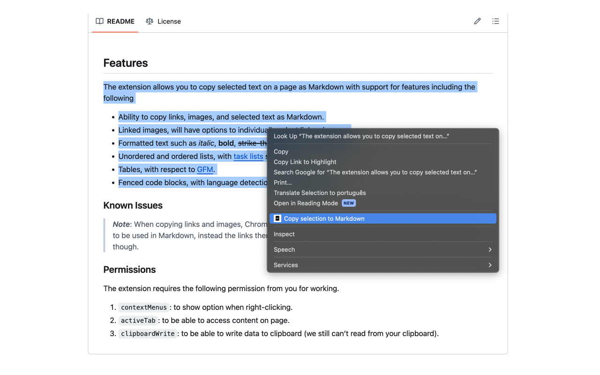

#  Copy to Markdown

> Browser extension to copy hyperlinks, images, and convert text to Markdown

## Install

- [**Chrome** extension][link-cws] [][link-cws]

## Screenshot

## Features

The extension allows you to copy selected text on a page and convert it to Markdown with support for features including the following

- Ability to copy links, images, and selected text, converting to Markdown.
- Linked images, will have options to individually select link or images.
- Formatted text such as _italic_, **bold**, ~~strike-through~~, and `inline code`.
- Unordered and ordered lists

### Known Issues

> **_Note_**: When copying links and images, Chrome doesn’t let you extract images alt text or anchors text content to be used in Markdown, instead the links themselves are used as link title. 

### Permissions

The extension requires the following permission from you for working.

1. `contextMenus`: to show option when right-clicking.
2. `activeTab`: to be able to access content on page.
3. `clipboardWrite`: to be able to write data to clipboard (we still can’t read from your clipboard).
4. `scripting`: to be able to execute the conversion to markdown and write data to clipboard.

## Credits

Inspired by [this project](https://github.com/notlmn/copy-as-markdown) from [@notlmn](https://github.com/notlmn)

This versions fixes sub lists bug on markdown generation.

## License

[MIT](license)

[link-cws]: https://chrome.google.com/webstore/detail/copy-to-markdown/nlaionblcaejecbkcillglodmmfhjhfi/
